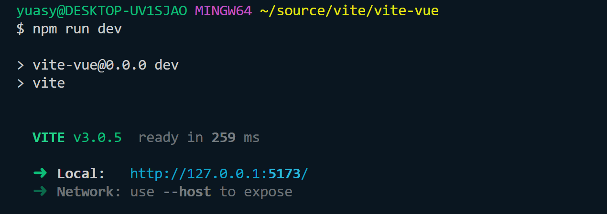
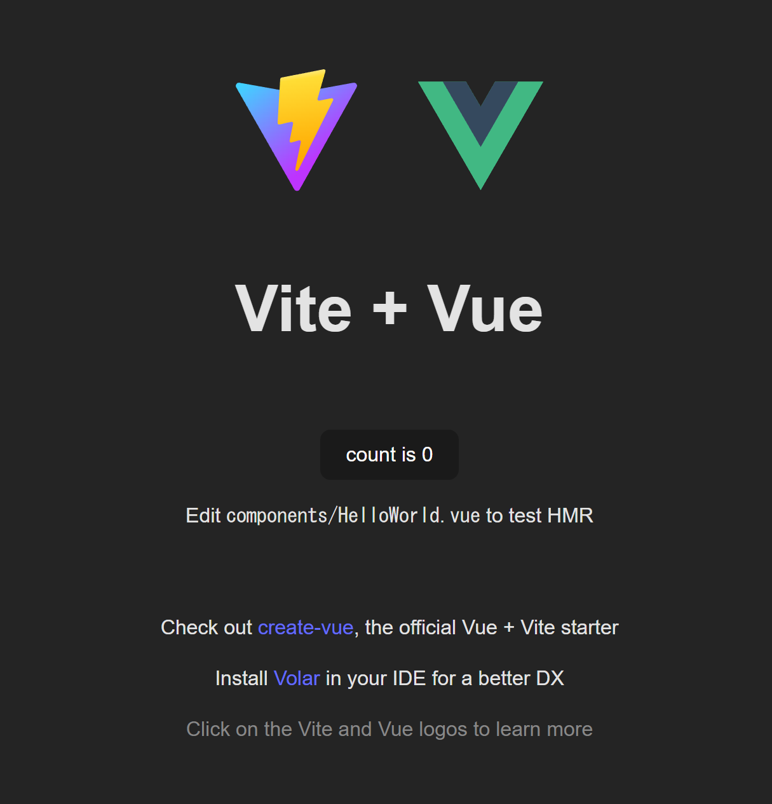

# このリポジトリについて
※しばらくは、このリポジトリの来歴から説明します。<br/>
[参考にさせていただいたサイト](https://www.sk-lab.co.jp/archives/11197)
<br/>
[比較のためvitenなしの場合を体験した際に参考にさせていただいた動画](https://youtu.be/iqe8HPJuY80)

<ol>
  <li>任意の作業用ディレクトリに移動してから、ひな形を作るコマンドを打つ。私の場合は以下の通り<br/>
  <br/>作業用ディレクトリ:   <code>~/source</code>
  <br/>プロジェクト名：vite-vue
  <br/>フレームワークの選択：vue
  <br/>文法チェックの選択：vue
  <br/>
  
  ```bash
  $ cd ~/source
  $ npm create vite@latest
  ? Project name: > vite-vue
  ? Select a framework: > vue
  ? Select a variant: > vue
  ```
  </li>
  <li>即座にプロジェクトが自動生成され下記のような案内が表示されるので、それにしたがってコマンドを打つ
  
  ```bash
  # 画面の案内
  Done. Now run:
  cd vite-vue
  npm install
  npm run dev

  # 案内通りにコマンドを打つ
  $ cd vite-vue
  $ npm install
  $ npm run dev
  ```
  
  すると、下図のように<code>http://127.0.0.1:5173</code>の参照を促される。
  

  </li>
  <li>プロジェクトひな形の完成を確認する
  画面の案内のとおりブラウザで<code>http://127.0.0.1:5173</code>をアクセスし次の画面が表示されたら成功
  <br/>
  

</ol>

<hr/>
# Vue 3 + Vite

This template should help get you started developing with Vue 3 in Vite. The template uses Vue 3 `<script setup>` SFCs, check out the [script setup docs](https://v3.vuejs.org/api/sfc-script-setup.html#sfc-script-setup) to learn more.

## Recommended IDE Setup

- [VS Code](https://code.visualstudio.com/) + [Volar](https://marketplace.visualstudio.com/items?itemName=Vue.volar)
